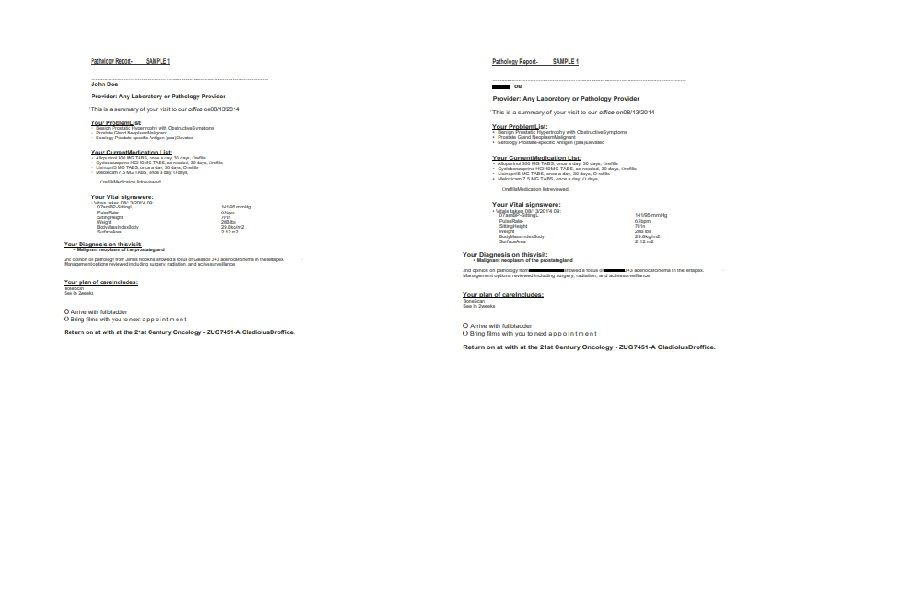

# Pdf masking portal

A react front end page for masking information on PDF, it is still under fine tuning.

A batch process is also available to batch processing:
    1. making sure the uploaded or scanned pdf is for the correct customer by scanning the names in the pdf file.
    2. removing sensitive information from the pdf file in batch.

The process will be moved to Azure.

Contact Us: desmondeds@outlook.com

<h1>Demo</h1>

